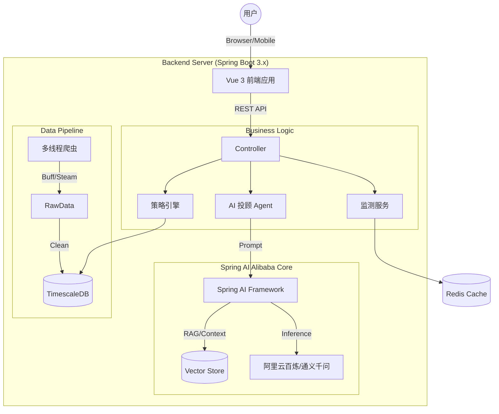

# 🦅 CS2-Market-Intelligence (CMI)

<p align="center">
  
  
  
  
  
</p>

> **基于 Spring AI Alibaba + Vue3 的 CS2 饰品全链路监测与智能量化分析平台。**
>
> *Market Data + GenAI = Alpha.*

[English Documentation](README_EN.md) | [演示视频](LINK_TO_VIDEO) | [部署文档](docs/deploy.md)

---

## 📖 项目简介 (Introduction)

**CS2-Market-Intelligence** 是一个专为 CS2 (Counter-Strike 2) 饰品市场打造的智能化监测系统。

不同于传统的爬虫工具，本项目率先引入 **Spring AI Alibaba**，利用大模型（LLM）能力对市场数据进行深层次解读。它不仅能告诉你“什么在涨”，还能结合全网舆情分析“为什么涨”，并给出风险提示。

本项目采用 **"Monolith First" (单体优先)** 策略，初期基于 Spring Boot 构建高性能单体应用，并预留了完整的 **Spring Cloud Alibaba** 微服务演进接口。

## 🏗 系统架构 (Architecture)

### 当前架构 (Phase 1: High-Performance Monolith)

利用 Spring AI 的 `ChatClient` 和 `RAG` 能力，将大模型无缝集成到 Java 业务流中。



### 演进路线 (Phase 2: Microservices)

未来将拆分为 `cmi-crawler` (数据), `cmi-analysis` (AI计算), `cmi-trade` (交易) 等微服务，使用 **Nacos** 做注册中心，**Sentinel** 做流量风控。

## ✨ 核心功能 (Features)

### 1. 🤖 AI 智能投顾 (Powered by Spring AI Alibaba)

* **市场情绪分析**：自动抓取 Reddit/贴吧 讨论贴，利用 LLM 分析市场情绪（恐慌/贪婪），辅助判断买卖时机。
* **智能研报生成**：每天定时生成《CS2 饰品日报》，由 AI 总结当日涨跌幅 Top10 及背后的原因。
* **自然语言查询**：支持用户提问 "帮我找一下最近一周跌幅超过 20% 且成交量稳定的印花"，AI 自动转化为 SQL 查询数据库。

### 2. 🦅 全局数据监测

* **跨平台价差监控**：实时计算 Buff 与 Steam 之间的汇率差，捕捉“挂刀”套利机会。
* **库存异动预警**：追踪大商库存，当某饰品库存短时间内剧烈波动时触发警报。
* **异常价格清洗**：基于统计学算法过滤“洗钱”或“互刷”产生的虚假成交记录。

### 3. 📈 现代化可视化看板

* **Vue 3 + ECharts/TradingView**：丝滑的交互体验。
* **实时 K 线**：毫秒级数据更新。
* **资产透视**：个人持仓盈亏实时计算。

## 🛠 技术栈 (Tech Stack)

| 领域 | 技术选型 | 说明 |
| :--- | :--- | :--- |
| **后端框架** | **Spring Boot 3.2** | 核心底座，Java 17+ |
| **AI 框架** | **Spring AI Alibaba** | 接入通义千问 (Qwen)，实现 RAG 与 Agent |
| **前端框架** | **Vue 3** + Vite + Pinia | 组合式 API 开发，高性能单页应用 |
| **UI 组件库** | Naive UI / Element Plus | 现代化 UI 设计 |
| **数据存储** | **MySQL 8.0** | 存储业务数据与近期价格历史 (MVP阶段) |
| **缓存/消息** | Redis, Kafka (Optional) | 缓存热点数据与异步解耦 |
| **网络 I/O** | Netty / Reactor | 维持 WebSocket 长连接推送 |
| **部署** | Docker, Docker Compose | 一键编排 |

## 🚀 快速开始 (Quick Start)

### 前置要求

* JDK 17+
* Node.js 18+
* Docker Desktop
* [阿里云百炼 API Key](https://bailian.console.aliyun.com/) (用于 AI 功能)

### 1. 启动基础依赖

使用 Docker Compose 启动数据库和 Redis：

```bash
cd deployment
docker-compose up -d

```

### 2. 后端配置与启动

修改 `src/main/resources/application.yml`，配置你的 API Key：

```yaml
spring:
  ai:
    dashscope:
      api-key: sk-xxxxxxxxxxxxxxxxxxxx # 你的阿里云 DashScope Key

```

启动 Spring Boot 应用：

```bash
./mvnw spring-boot:run

```

### 3. 前端启动

```bash
cd cmi-ui
npm install
npm run dev

```

访问 `http://localhost:5173` 即可看到仪表盘。

## 🗺 路线图 (Roadmap)

我们致力于将 CMI 打造成最专业的开源饰品量化平台。
* [ ] **v0.0.0（基本框架）**
* [ ] 创建 Spring Boot 项目
* [ ] 导入CS2所有饰品数据（入库）
* [ ] 和Steam、BUFF建立连接，获取对应的饰品价格信息（策略模式）


* [ ] **v0.1.0 (MVP)**
* [ ] 搭建 Spring Boot + Vue3 脚手架
* [ ] 集成 Spring AI Alibaba 完成基础对话功能
* [ ] Buff 热门饰品爬虫与数据入库 (TimescaleDB)


* [ ] **v0.5.0 (AI 增强)**
* [ ] 实现 "AI 市场日报" 生成功能
* [ ] 接入 RAG (检索增强生成)，让 AI 基于历史价格回答问题
* [ ] 微信/钉钉 机器人报警推送


* [ ] **v1.0.0 (Cloud Ready)**
* [ ] 引入 Nacos 配置中心
* [ ] 模块拆分：数据层与业务层解耦
* [ ] 开放 RESTful API 供社区调用


- [ ] **v1.5.0 (Performance)**
- [ ] 随着数据量增长，将历史价格数据表迁移至 TimescaleDB 或 ClickHouse
- [ ] 引入分库分表策略


## 🤝 贡献指南 (Contributing)

本项目遵循 Git Flow 工作流。

1. Fork 本仓库
2. 创建特性分支 (`git checkout -b feature/AmazingFeature`)
3. 提交更改 (`git commit -m 'Add some AmazingFeature'`)
4. 推送到分支 (`git push origin feature/AmazingFeature`)
5. 提交 Pull Request

## ⚠️ 免责声明 (Disclaimer)

1. **学习用途**：本项目仅供 Java 技术与 AI 应用学习交流，**严禁用于任何商业盈利行为**。
2. **账号安全**：CS2 饰品交易涉及资金安全，请勿将 Steam 账号密码托管于任何非官方平台。使用爬虫功能时请严格遵守目标网站 `robots.txt` 协议。
3. **投资风险**：AI 生成的建议仅供参考，不构成任何投资建议。市场有风险，入市需谨慎。